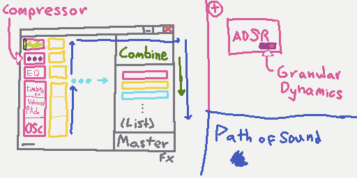

# pomme-synth
 A subtractive synth designed around frequency spectrum composition

### how to build:
- `cd pomme-synth/`
- genrate vst2: `cargo build --release`
- gui only: `cargo run --release --features "gui_only"`

### rough ui markup

### current features
- gui that maybe works on all platforms?

### future features
- add a 3 mode (highpass, bandpass, lowpass) filter
- Enable internal combination of multiple instances of the synth
- Add a builtin (instance local) compressor
- Add the ability to loop a simple sound file instead of a waveform
- Simple asdr for dynamics
- More complicated dynamics controls. (possibly granular?)

### info
- largely inspired by https://www.octasine.com/ , big thanks to them!
- named pomme, because of the gravity apple thingy & that sound in pomme visually goes up each module, then down again.
